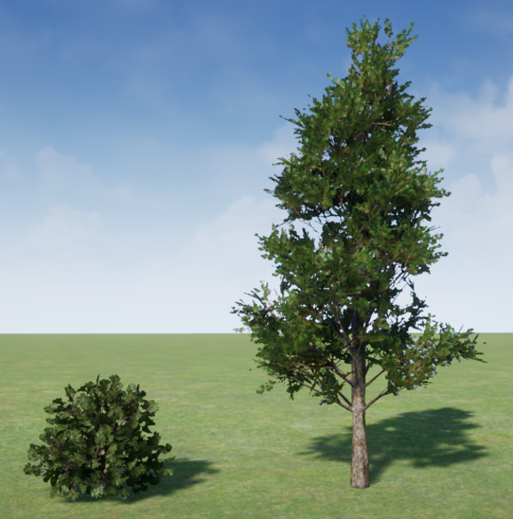

# Black-Box Adversarially Compounding Regret Through Evolution (BACRE) Applied to a 2D Off-Road Autonomy System

## Description

This codebase provides an implementation of BACRE as applied to off-road autonomus vehicles (AVs) using the [AutomaticSceneGeneration](https://github.com/tsender/AutomaticSceneGeneration) plugin for UE4. While the implementation of BACRE can be extended to 3D, the AutomaticSceneGeneration currently only provides support for creating 2D off-road scenes (hence the "2D" in the title).

This codebase contains the following ROS packages:
1. `adversarial_scene_gen`: Contains the primary ROS node for BACRE.
2. `astar_trav`: Contains the code needed to run the A*-traversability autonomy system as used in the experiments in the BACRE paper.
3. `astar_trav_msgs`: Contains custom ROS messages for the `astar_trav` package.
4. `auto_scene_gen_core`: Contains the main ROS nodes and objects needed to interact with an AutoSceneGenWorker and AutoSceneGenVehicle in UE4.
5. `auto_scene_gen_msgs`: Contains the custom message and service definitions for the AutoSceneGen platform.

Note: For convenience, both `auto_scene_gen_*` packages have been copied directly from the [auto_scene_gen](https://github.com/tsender/auto_scene_gen) ROS2 interface to keep all of the code in a single repository.

## Citation

If you use our work in an academic context, we would greatly appreciate it if you used the following citation:

TODO

## Installation

Please refer to the [AutomaticSceneGeneration](https://github.com/tsender/AutomaticSceneGeneration) plugin for UE4 and the corresponding ROS2 interface [auto_scene_gen](https://github.com/tsender/auto_scene_gen) for the software requirements to use this codebase. All of our UE4 simulations were ran on computers running Windows 10 with UE 4.26, and all of the ROS code was developed/executed in docker containers, with a Ubuntu 20.04 docker image, running on linux machines. You can download our docker image with the tag `tsender/tensorflow:gpu-focal-foxy` (you may need to login to your docker account from the command line to pull the image).

#### Setting Up the ROS Workspace

This process is effectively copied from the README in [auto_scene_gen](https://github.com/tsender/auto_scene_gen) and configures this repo to act as a ROS overlay.

1. Download the provided docker image or add all of its libraries to your Ubuntu system.
2. Let's put all of our code in a common folder: `mkdir ~/auto_scene_gen_ws`
3. Clone and build rosbridge_suite with the root ROS installation as an underlay
   ```
   cd ~/auto_scene_gen_ws/
   mkdir rosbridge_suite
   cd rosbridge_suite/
   git clone https://github.com/tsender/rosbridge_suite.git src
   source /opt/ros/foxy/setup.bash
   colcon build
   ```
4. Clone and build this repository with rosbridge_suite as an underlay:
    ```
   cd ~/auto_scene_gen_ws/
   mkdir bacre_2D
   cd bacre_2D/
   git clone https://github.com/tsender/bacre_2D.git src
   source ../rosbridge_suite/install/setup.bash
   colcon build
   source install/setup.bash
    ```

The last step configures the `bacre_2D` workspace to be our final ROS overlay. We will then only need to source this overlay with
```
source ~/auto_scene_gen_ws/bacre_2D/install/setup.bash
```
before running our ROS code.

## Running the Experiments from the Paper

### UE4 Setup Part 1: Requirements

In UE4 we need to create an AutoSceneGenVehicle actor, create a few StructuralSceneActors, setup the AutoSceneGenWorker, and then configure rosbridge. It is assumed that the units in Unreal Engine is configured for centimeters for position and degrees for orientation (these should be the default settings).

#### AutoSceneGenVehicle

The experiments in the paper use a Polaris MRZR virtual vehicle model (if you do not have access to such a model, then any other car model will suffice for learning how to use the code). Follow these steps to create an [AutoSceneGenVehicle](https://github.com/tsender/AutomaticSceneGeneration/blob/main/Documentation/actors.md) child blueprint, and use the appropriate skeletal mesh for the vehicle model you have at hand. Under the Details panel for this actor, we will use the default values. Under the `Auto Scene Gen Vehicle` tab, make sure the following parameters are set to:
- `Linear Motion Threshold`: 2
- `Vehicle Name`: "vehicle"

Now we need to attach the [sensors](https://github.com/tsender/AutomaticSceneGeneration/blob/main/Documentation/sensors.md). The vehicle in the experiments has a forward-facing camera and a localization sensor.
- Open up your vehicle blueprint
- Add the camera
    - Add a CompleteCameraSensor at the location (150, 0, 140) centimeters relative to the mesh origin, with zero roll, pitch, and yaw. Note, these coordinates are in the left-hand coordinate system.
    - Set both the `Image Height` and `Image Width` to 256.
    - Set the `Frame Rate` to 15 Hz.
    - Check the `Enable Depth Cam` box to enable the depth camera.
    - Set the `Sensor Name` to "camera" (the default value).
- Add the locaization sensor
    - Add a LocalizationSensor at the mesh origin with zero roll, pitch, and yaw.
    - Set the `Frame Rate` to 60 Hz.
    - Set the `Sensor Name` to "localization" (the default value).

Next we will configure the PID Drive-by-Wire component, which is a component in every AutoSceneGenVehicle. With the vehicle blueprint still open, click on the `Drive By Wire Component` in the component tree. Then under the Details panel, look for the `PID Drive By Wire` tab and make sure the following parameters are set (these should be the default values):
- `Manual Drive`: False (unchecked)
- `Max Manual Drive Speed`: 500
- `Kp Throttle`: 0.0002
- `Kd Throttle`: 0.0007

Finally, make sure this actor is configured to be the default pawn class. Create a new game mode blueprint and set the default pawn class to be the new vehicle blueprint you just created.

#### StructuralSceneActors

The experiments allow for Barberry bushes and Juniper trees to be placed in the scene. Create child blueprints of a [StructuralSceneActor](https://github.com/tsender/AutomaticSceneGeneration/blob/main/Documentation/actors.md) using an appropriate mesh (something similar may suffice, especially if you are just learning how to use this setup). The image below shows what the Barberry bush (left) and Juniper tree (right) look like as used in the experiments.



The default values under the Details tab will suffice, but make sure the following values are set:
- `Traversable Height Threshold`: 20
- `Always Traversable`: False (unchecked)


#### AutoSceneGenWorker

The AutoSceneGenWorker actor is the primary actor in UE4 that controls scenario creation and execution. There must exist one of these actors in every level. The following parameters will also need to be set:
- `Worker ID`: 0 (more on this parameter later)
- `ROS Connection ID`: 0 (leave this alone)
- `Landscape Material`: We used a modified version of the `/Game/StarterContent/Materials/M_Ground_Grass` material in which we set the texture UV scaling to 100.
- `Debug SSASubclasses`: Make sure this TArray is empty, as we do not want additional StructuralSceneActors appearing in the scenarios.
- `Auto Scene Gen Client Name`: "asg_client"

While the landscape parameters are overridden from the RunScenario requests, we will need to set a few parameters appropriately before you press Play so that the vehicle starts on/above the landscape (otherwise it will just fall forever):
- `Debug Landscape Subdivisions`: 1
- `Landscape Size`: 6000
- `Landscape Border`: 10000

We also need to make sure the PlayerStart actor is located above the landscape when the game is started. For the PlayerStart actor, set the following Transform parameters in the Details panel to:
- `Location`: x = 0, y = 0, z = 50
- `Rotation`: x = 0, y = 0, z = -45

#### AutoSceneGenLandscape

Each level must have one of these actors. Simply add the actor to the World Outline. The AutoSceneGenWorker will interact with it as required.

#### ROSBridgeParamOverride

Each level should have a ROSBridgeParamOverride actor so it can have its own dedicated rosbridge node. NOTE: All of the below fields are specific to the [feature/specify_ros_version](https://github.com/tsender/ROSIntegration/tree/feature/specify_ros_version) branch of @tsender's `ROSIntegration`fork.

- `ROSBridge Server Hosts`: TArray of IP addresses of the computer running rosbridge. Each entry pairs with the corresponding element in the `ROSBridge Server Ports` array to define the servers. Only use one IP for now.
- `ROSBridge Server Ports`: TArray of port numbers that rosbridge is listening to. Each entry pairs with the corresponding element in the `ROSBridge Server Hosts` array to define the servers. Only use a single port in this array for now.
- `ROSVersion`: 2
- `Clock Topic Name`: "/clock\<wid\>", where \<wid\> is replaced by the associated Worker ID

### UE4 Setup Part 2: Configuring Parallel Simulations

Since most modern gaming desktops are quite powerful, it is expected that you will be able to run more than one UE editor at once. In our paper, we used 12 independent simulations across two Windows machines, each running six workers. To configure such a setup, first create one level following the above instructions. Save the level as "level_0" (you can use whatever naming conventon you like), as this level will be our first worker. Then, create $n$ copies of this level, "level_1", "level_2", ..., "level_n". Within level $i$, set the Worker ID as $i$, add the port $9100 + i$ to the `ROSBridge Server Ports` array, and set the `Clock Topic Name` (for level 0 this will be "/clock0").

Note: Regardless of how you split up the independent simulations, every active level must have a different Worker ID associated with it (as duplicates will cause problems). Also, all IDs should be consecutive, regardless of the lowest ID you start at. For example, 0,1,2,...,11 or 10,11,12,...,21 are acceptable IDs for using 12 parallel workers.

### ROS Node Setup

#### Autonomy System

The experiments in the paper used multiple variations of a custom autonomy system developed entirely in Python and can be found in the `astar_trav` package. A DNN-based perception system classifies image pixels as being part of a traversable or non-traversable object, or to the sky. The dataset is in the folder `astar_trav/Datasets_256x256/NoClouds_Trees_Bushes_SunIncl0-15-30-45-60-75-90`, the network is defined in the `astar_trav/semseg_networks.py`file, the training and prediction code is in the `astar_trav/semantic_segmentation.py` file, and the model used is in the folder `astar_trav/Datasets_256x256/NoClouds_Trees_Bushes_SunIncl0-15-30-45-60-75-90/models/small_v2`. The dataset contains roughly 300-500 images of scenes per inclination angle of the sun from 0 to 90 degrees in 15 degree increments. The path planner is an A* voting planner that adds votes to potential obstacle locations (the more votes, the more likely that vertex will be avoided in the planning stage) which affect the edge cost in an A* planner. Then a path follower tracks the latest A* path at a constant speed using a PD controller for steering. 

There are two implementations of the autonomy system. Version 1 consists of two nodes, defined in the files `astar_trav/astar_trav_2D_all_in_on_node.py` (for the A* mapping and planning) and `astar_trav/simple_path_follower_node.py` (for control). In version 2, the A* mapping and planning operations were split into separate nodes, defined in `astar_trav/astar_trav_2D_mapping_node.py` and `astar_trav/astar_trav_2D_planning_node.py`, respectively. Creating this second version also required creating custom messages which are defined in the `astar_trav_msgs` package.

Choose a version of the autonoy system to run, `v1` or `v2`, and then modify the parameters in the `main()` function at the bottom of each of the above-mentioned files. Then build the packages with `colcon build` for the changes to take effect.

#### BACRE Node

The BACRE node used in the experiments is defined in the `adversarial_scene_gen/bacre_2D_astar_trav_node.py` file. This file defines a number of child classes for the `auto_scene_gen` interface, as well as some custom classes needed for general operation. This is a very big file, but almost everything should be well-commented. Here is a brief description of some of the main classes defined in this file:
- `ScenarioOutcome`: Stores information regarding the outcome of a single run/trial for a scenario.
- `Scenario`: Stores information about all the outcomes for running a particular scenario.
- `ScenarioBuilderAndRefAgent`: The customized scenario builder and reference agent for BACRE. A child class of `auto_scene_gen_core/AutoSceneGenScenarioBuilder`.
- `BACREWorkerRef`: A customized class that stores information and the status for a given worker. A child class of `auto_scene_gen_core/AutoSceneGenWorkerRef`.
- `ScenarioRegretManager`: A class for storing the scenario regrets in a single place, along with some other high-level relevant information. This class makes it easy to store and quickly access this data so we don't have to load all of the scenarios into memory each time.
- `BACRE2DAstarTrav`: The BACRE node class, which is a child class of `auto_scene_gen_core/AutoSceneGenClient`.

The `main()` function is the access point for running the node and defines all of the parameters needed by the node and various objects. The BACRE2DAstarTrav node can be put into several modes of operation:
- `MODE_BACRE`: Will run the BACRE algorithm to generate adversarial scenarios
- `MODE_RANDOM`: Will generate random scenarios
- `MODE_CGA`: Will use a continuous Genetic Algorithm (CGA) to generate adversarial scenarios
- `MODE_ANALYSIS`: Analyze all generated scenarios (according to user-specific needs)
- `MODE_ANALYSIS_PLOT`: Make plots based on latest analysis
- `MODE_ANALYSIS_REPLAY`: Make plots and analyze replayed scenarios
- `MODE_SCENE_CAPTURE`: Capture various point-of-views (images) from certain scenarios
- `MODE_REPLAY`: Replay certain scenarios by ranking (allows you to save/log additional vehicle node data for further analysis)

The current `main()` function shows how all of parameters were setup to run the experiments. There is also code for extracting additional data and making summary plots for the experiments that were conducted.

### Running the Experiments

At this point everything should now be ready to run the experiments. These instructions will follow the procedure we used (though you can easily adapt this for the computing resources in your own setup). 

NOTE: It is assumed that each ROS command is being executed from the directory `~/auto_scene_gen_ws/bacre_2D/`.

1. Launch the rosbridge servers on the two Ubuntu computers (computer 0 and computer 1)
    - Make a docker container, source the ROS workspace overlay we created above, and run
        ```
        ros2 launch adversarial_scene_gen rosbridge_pc0_launch.py
        ```
    - Computer 1 should call the file `rosbridge_pc1_launch.py`.
2. On each Windows computer, open six editor windows and make sure each editor has a different map (map IDs 0-5 on one computer and 6-11 on the other). Press Play in each editor. All editors should start up without problems and connect to the configured rosbridge.
3. Launch the BACRE node on Ubuntu computer 0
    - Make a new docker container, source the ROS overlay, and run
        ```
        ros2 run adversarial_scene_gen bacre_2D_astar_trav
        ```
        You could also use the launch file instead
        ```
        ros2 launch adversarial_scene_gen bacre_2D_astar_trav_simple_controller_launch.py
        ```
4. Run the ROS autonomy stacks (we will use version v2 in this example)
    - A few things to keep in mind:
        1. Each autonomy stack should be run inside its OWN docker container using its OWN set of dedicated CPU cores. No two autonomy stacks should be using the same CPU cores. In our experience, allowing all the autonomy stacks to run on any available CPU core created problems due to the large overhead associated with the poorly designed ROS2 execution model. Consequently, all node callbacks experienced a dramatic slow down and did not execute at the proper rates. Giving each autonomy stack its own set of physical CPU cores removes this problem and also allows for greater consistency across simulations.
        2. All vehicle nodes need to know which computer they are running on relative to where the controlling AutoSceneGenClient node (in this case, the BACRE node) is running.
    - Running an autonomy stack associated with ID \<wid\> on the same computer as the BACRE node:
        - Make a docker container, source the ROS overlay, and run
            ```
            ros2 launch astar_trav worker_astar_trav_2D_v2_launch.py wid:=<wid>
            ```
            Autonomy stacks associated with IDs 0-5 are executed on computer 0 in our setup.
    - Running an autonomy stack associated with ID \<wid\> on a different computer than where the BACRE node is:
        - Make a docker container, source the ROS overlay, and run
            ```
            ros2 launch astar_trav worker_astar_trav_2D_v2_launch.py wid:=<wid> asg_client_ip_addr:=<ip_addr>
            ```
            where \<ip_addr\> is the IP address of the computer running the AutoSceneGenClient node (in our case, this is the IP address of computer 0). Autonomy stacks associated with IDs 6-11 are executed on computer 1 in our setup.
    - To simplify the above commands, we created shell scripts that took just the worker ID as an argument. The script for running an autonomy stack on the local computer (computer 0) looked like:
        ```
        #! \usr/bin/bash
        wid=$1
        ros2 launch astar_trav worker_astar_trav_2D_v2_launch.py wid:=${wid}
        ```
        And the script to run an autonomy stack on the remote computer (computer 1) looked like:
        ```
        #! \usr/bin/bash
        wid=$1
        ros2 launch astar_trav worker_astar_trav_2D_v2_launch.py wid:=${wid} asg_client_ip_addr:=<computer0_ip_addr>
        ```
        where \<computer0_ip_addr\> was filled in appropriately.

## Running Your Own Experiments

This entire platform should be well-commented for you to understand how everything works and what the necessary components are. Please read through ALL of the provided documentation across the various repos to help you customize it to your needs. As for this repo, use the `adversarial_scene_gen` package as a guide for modifying the BACRE node, and use the`astar_trav_*` packages as a guide when creating a custom autonomy stack.

Please reach out with any questions, and we will do our best to respond when we can.

## Known Problems

See the "Known Problems" section in the [auto_scene_gen](https://github.com/tsender/auto_scene_gen) README.